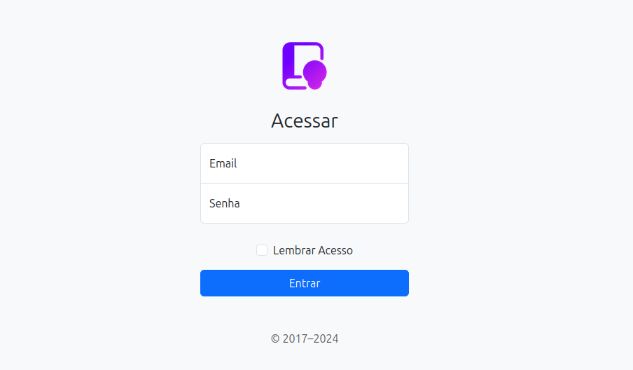

# Documentação do Projeto

O projeto Leia.me surgiu para organizar o compartilhamento de livros entre leitores que estão geograficamente próximos. Podendo o usuario cadastrar os livros que deseja doar, e aceitar ou não os pedidos para que os livros já lidos não fique parado na estante e possa contribuir com o acesso de outros leitores aos titulos disponibilizados no portal.

>Não precisamos guardar um livro a sete chaves na estante, toda leitura que é boa dura o tempo necessário para se tornar inesquecivel.

## Core
As configurações gerais do projeto ficam aqui nesse diretório core. Aqui contem os Arquivos Essenciais de um projeto Django. Quando criamos um novo projeto, esses arquivos são gerados automaticamente para ajudar na configuração e execução do nosso aplicativo web.

Esses arquivos são essenciais para configurar e executar nosso projeto Django de forma eficaz. Eles fornecem os pontos de entrada e configuração necessários para que nosso aplicativo funcione corretamente.

### Arquivo settings.py
Este arquivo é onde definimos as configurações do projeto Django. Aqui efetuamos coisas como configurações de banco de dados, configurações de middleware, configurações de segurança, configurações de idioma e fuso horário, configurações de arquivos estáticos e media, entre outras coisas.

Definimos tambem variáveis importantes como DEBUG (para o ambiente de desenvolvimento), ALLOWED_HOSTS (quais hosts podem servir nosso aplicativo), INSTALLED_APPS (aplicações instaladas no nosso projeto), DATABASES (configurações do banco de dados), entre outras.

Este arquivo é fundamental para configurar o comportamento do nosso aplicativo Django e é onde passaremos a maior parte do tempo configurando nosso projeto.

**Banco de Dados Local**
  
  Para teste local manter essas linhas de código sem os comentários.
  

**Banco de Dados em Produção**

  A partir do momento que for testar em produção, retirar os comentarios abaixo;
  

### Arquivo urls.py
Este arquivo é onde definimos os padrões de URL para nosso aplicativo. Ele mapeia URLs para views específicas no projeto.

Importamos a função path ou re_path do Django para definir os padrões de URL. Cada URL é mapeada para uma view, que é onde a lógica do nosso aplicativo é executada.

Podemos definir URLs diretamente neste arquivo ou podemos criar URLs modulares usando o include, o que é útil para organizar URLs em diferentes partes do aplicativo.

### Arquivo asgi.py
>Asynchronous Server Gateway Interface

Este arquivo é usado para configurar o servidor ASGI para nosso aplicativo. ASGI é uma especificação que permite que aplicativos web assíncronos interajam com servidores web assíncronos em Python.

No Django, o ASGI é usado para lidar com tarefas assíncronas, como WebSockets, long polling e outras operações que envolvem comunicação em tempo real.

Por padrão, geralmente não precisamos modificar este arquivo, a menos que estejamos fazendo algo muito específico que requer configuração personalizada do ASGI.

### Arquivo wsgi.py
>Web Server Gateway Interface

Este arquivo é usado para configurar o servidor WSGI para seu aplicativo. WSGI é uma especificação que descreve como os servidores web podem se comunicar com aplicativos web Python.

No Django, o WSGI é usado para servir nosso aplicativo em servidores web tradicionais, como Apache ou Nginx.

Novamente, por padrão, geralmente não precisamos modificar este arquivo, a menos que estejamos fazendo algo muito específico que requer configuração personalizada do WSGI.

## Usuarios
Inicialmente vamos trabalhar apenas com a tela de Login, e uma tela de cadastro dos usuário.

**Tela de Login do Usuário;**

Disponibilizado uma tela de login simplificada, onde o usuário vai acessar a plataforma através de email e senha, podendo salvar seu acesso no navegador.

**Tela de Cadastro do Usuário;**

Cadastro do usuário tambem simplificado, porem com aproveitamento do espaço em tela para divulgar alguns números da plataforma, como total de acerto publico atualizado disponivel para emprestimo, total de paginas lidas, entre outros detalhes para incentivar os leitores a envolver-se nessa comunidade.

### Arquivo admin.py
Anotações importantes sobre o admin aqui...
### Arquivo apps.py
Anotações importantes sobre o admin aqui...
### Arquivo models.py
Anotações importantes sobre o admin aqui...
### Arquivo tests.py
Anotações importantes sobre o admin aqui...
### Arquivo urls.py
As rotas para a aplicação de usuários inicialmente vamos trabalhar com uma user/create/ para cadastrar novos usuários na aplicação, e uma user/login/ para autenticar os usuários na aplicação.

### Arquivo views.py
**UserCreateView;** responde as requisições da rota user/create/, e valida os dados para inserir novos cadastros no banco de dados.

**UserLoginView;** responde as requisições da rota user/login/, e autentica os usuários que tenham permissão de acesso válidas na aplicação.

